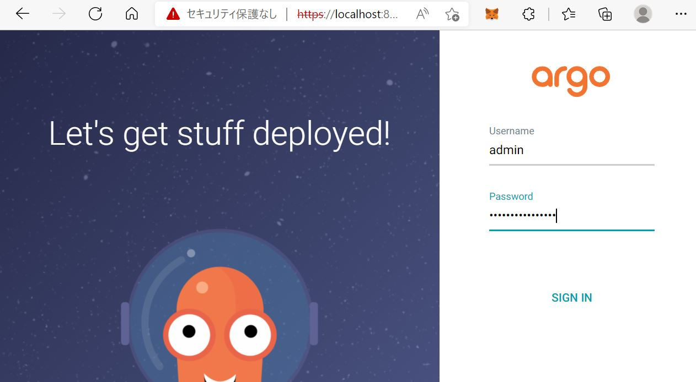
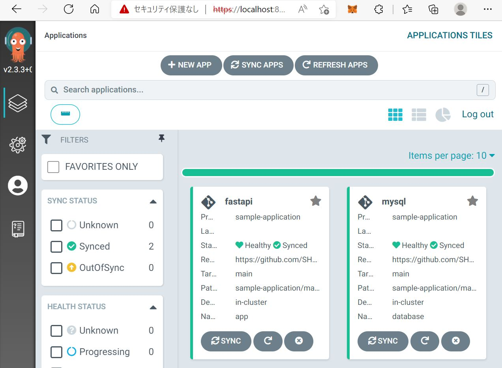

# sample-application

## Application overview


## Create namespace

```
kubectl create namespace database
kubectl create namespace app
```
## Launch applocation by CD tool(Argo CD)

### Setup Argo CD

1. Change current directory.

    ```
    cd ./argocd/
    ```

1. Install Argo CD.

    ```
    kubectl create namespace argocd
    kubectl apply -n argocd -f https://raw.githubusercontent.com/argoproj/argo-cd/stable/manifests/install.yaml
    ```

1. Create application.

    ```
    kubectl apply -f argocd_appproject.yaml,argocd-mysql-application.yaml,argocd-fastapi-application.yaml
    ```

1. Argo CD operation check.

    1. Setting port-forwarding.

        ```
        kubectl port-forward svc/argocd-server -n argocd 8081:443
        ```

    1. Login Using The GUI.

        Access 「localhost:8081」 in your web browser.
        * Username:admin
        * Password:<kubectl -n argocd get secret argocd-initial-admin-secret -o jsonpath="{.data.password}">をbase64でデコードした値  
        
        
    
    1. Open the Applications tab.

        Make sure the status of mysql and fastapi is [Health / Synced]
        

1. API server operation check.

    Check the operation by referring to the following.  
    [Launch applocation by manual]-[Create applicaion(fastapi)]-[API server operation check.]

reference
* https://argo-cd.readthedocs.io/en/stable/getting_started/  

## Launch applocation by manual

### Create database(mysql)

1. Change current directory.

    ```
    cd ./manifest/mysql/
    ```

1. Create deployment.

    ```
    kubectl apply -f mysql-deployment.yaml -n database
    ```

1. Check the mysql pod has been created.

    ```
    kubectl get pod -n database
    ```

1. Check the test_db database has been created.

    ```
    kubectl exec -n database -it mysql-***-*** -- mysql -uroot -ppasswd

    mysql> show databases;
    +--------------------+
    | Database           |
    +--------------------+
    | information_schema |
    | mysql              |
    | performance_schema |
    | sys                |
    | test_db            |
    +--------------------+
    5 rows in set (0.00 sec)

    mysql>
    ```

1. Create service

    ```
    kubectl apply -f mysql-service.yaml -n database
    ```

### Create applicaion(fastapi)

1. Change current directory.

    ```
    cd ./manifest/fastapi/
    ```

1. Create deployment , configmap , and secret.※

    ```
    kubectl apply -f app-deployment.yaml,app-configmap.yaml,app-secret.yaml -n app
    ```

1. Create service.※

    ```
    kubectl apply -f app-service.yaml -n app
    ```

1. API server operation check.

    1. Setting port-forwarding.

        ```
        kubectl port-forward service/app 8080:80 -n app
        ```

    1. Access 「localhost:8080」 in your web browser.

        

    1. Access 「localhost:8080/docs/」 in your web browser.

        

    1. POST user information in your web browser. Confirm that the http200 return code is returned.
   
        

    1. GET users information in your web browser. Confirm that the HTTP200 return code and users information are returned.

        

    1. PUT to update user information in your terminal. Confirm that the HTTP200 return code and null code are returned.

        ```
        curl -v -X PUT -H "Content-Type: application/json" -d @put.json "http://localhost:8080/user"
        
        ・・・
        < HTTP/1.1 200 OK

        null
        ・・・
        ```

    1. GET to confirm that the user information has been updated. Confirm that the HTTP200 return code and user information are returned.

        ```
        curl -v -X GET -H "Content-Type: application/json" "http://localhost:8080/users/1"

        ・・・
        < HTTP/1.1 200 OK

        {"name":"Emma","age":3,"id":1}
        ・・・
        ```
    ※yaml files were created using the following command.

    ```
    # configmap
    kubectl create configmap app --from-env-file=env.txt --dry-run -o yaml > app-configmap.yaml

    # secret
    kubectl create secret generic app --from-literal=MYSQL_PASSWORD=passwd --dry-run=client -o yaml > app-secret.yaml

    # service
    kubectl create service clusterip app --tcp=80 --dry-run=client -o yaml > app-service.yaml
    ```

### Delete Resources

1. Delete mysql resources.

    ```
    kubectl delete -f mysql-deployment.yaml,mysql-service.yaml -n database
    kubectl delete namespace database
    ```

 1. Delete app resources.

    ```
    kubectl delete -f app-deployment.yaml,app-configmap.yaml,app-secret.yaml,app-service.yaml -n app
    kubectl delete namespace app
    ```