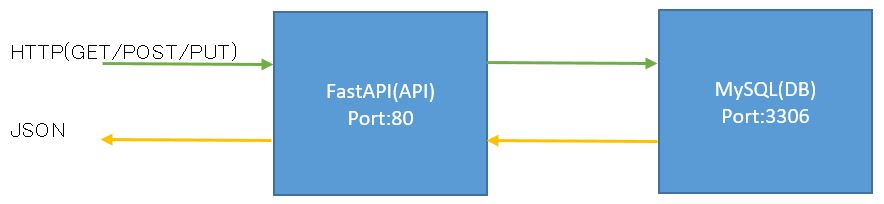
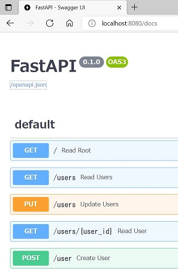
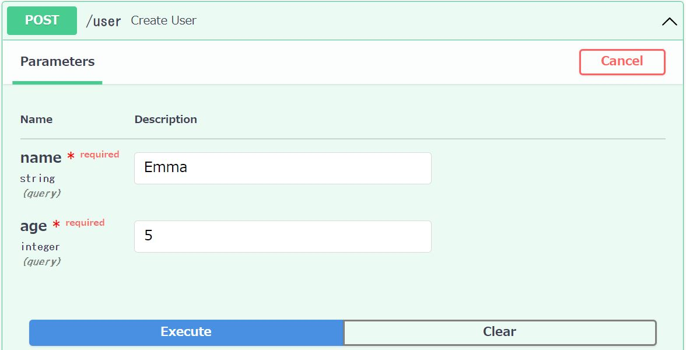
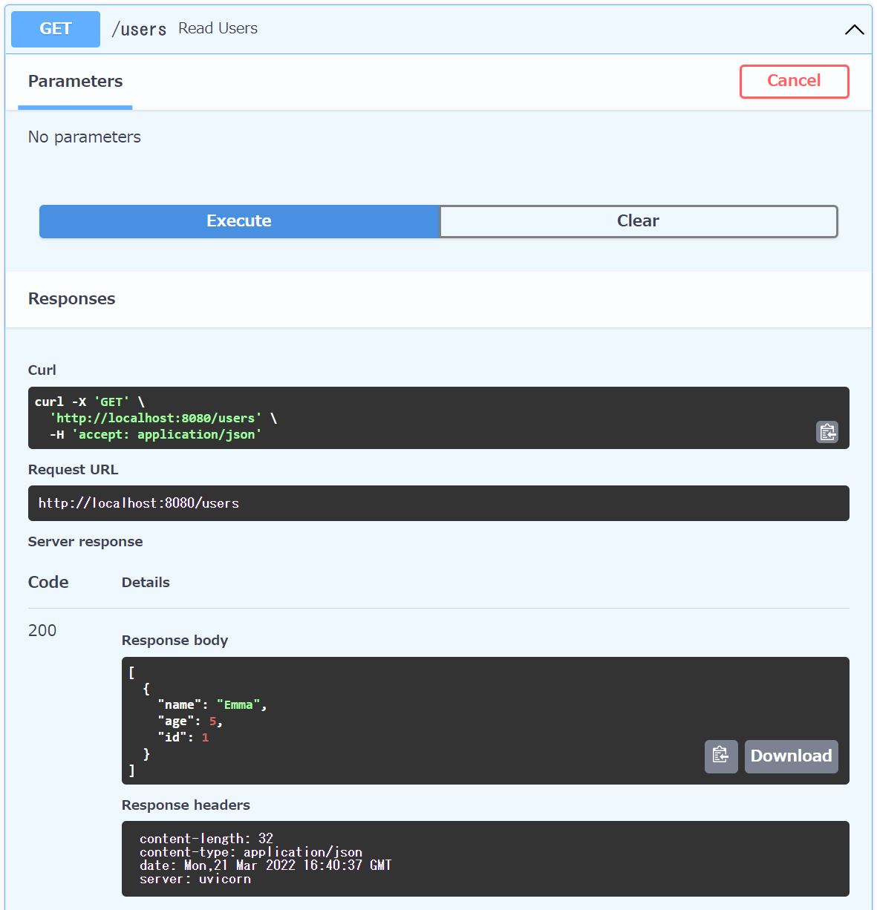

# sample-application

## Application overview



## Create database(mysql)

1. Create namespace.

    ```
    kubectl apply -f mysql-namespace.yaml
    ```

1. Create deployment.

    ```
    kubectl apply -f mysql-deployment.yaml -n database
    ```

1. Check the mysql pod has been created.

    ```
    kubectl get pod -n database
    ```

1. Check the test_db database has been created.

    ```
    kubectl exec -n database -it mysql-***-*** -- mysql -uroot -ppasswd

    mysql> show databases;
    +--------------------+
    | Database           |
    +--------------------+
    | information_schema |
    | mysql              |
    | performance_schema |
    | sys                |
    | test_db            |
    +--------------------+
    5 rows in set (0.00 sec)

    mysql>
    ```

1. Create service

    ```
    kubectl apply -f mysql-service.yaml -n database
    ```

## Create applicaion(python)

1. Create namespace.

    ```
    kubectl apply -f app-namespace.yaml
    ```

1. Create deployment , configmap , and secret.※

    ```
    kubectl apply -f app-deployment.yaml,app-configmap.yaml,app-secret.yaml,app-service.yaml -n app
    ```

1. Create service.※

    ```
    kubectl apply -f app-service.yaml -n app
    ```

4. API server operation check.

    1. Setting port-forwarding.

        ```
        kubectl port-forward service/app 8080:80 -n app
        ```

    1. Access 「localhost:8080」 in your web browser.

        

    1. Access 「localhost:8080/docs/」 in your web browser.

        

    1. POST user information in your web browser. Confirm that the http200 return code is returned.
   
        

    2. GET users information in your web browser. Confirm that the HTTP200 return code and users information are returned.

        

    3. PUT to update user information in your terminal. Confirm that the HTTP200 return code and null code are returned.

        ```
        curl -v -X PUT -H "Content-Type: application/json" -d @put.json "http://localhost:8080/user"
        
        ・・・
        < HTTP/1.1 200 OK

        null
        ・・・
        ```

    4. GET to confirm that the user information has been updated. Confirm that the HTTP200 return code and user information are returned.

        ```
        curl -v -X GET -H "Content-Type: application/json" "http://localhost:8080/users/1"

        ・・・
        < HTTP/1.1 200 OK

        {"name":"Emma","age":3,"id":1}
        ・・・
        ```
※yaml files were created using the following command.

```
# configmap
kubectl create configmap app --from-env-file=env.txt --dry-run -o yaml > app-configmap.yaml

# secret
kubectl create secret generic app --from-literal=MYSQL_PASSWORD=passwd --dry-run=client -o yaml > app-secret.yaml

# service
kubectl create service clusterip app --tcp=80 --dry-run=client -o yaml > app-service.yaml
```

## Delete Resources

1. Delete mysql resources.

    ```
    kubectl delete -f mysql-deployment.yaml,mysql-service.yaml -n database
    kubectl delete -f mysql-namespace.yaml
    ```

 1. Delete app resources.

    ```
    kubectl delete -f app-deployment.yaml,app-configmap.yaml,app-secret.yaml,app-service.yaml -n app
    kubectl delete -f app-namespace.yaml
    ```
